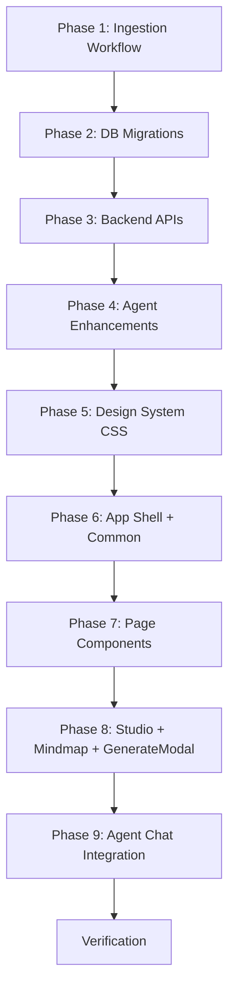

# Implement New Press Frontend (v3)

Rebuild the Press frontend from the v2 prototype ([docs/improved_frontend/extracted_v2/](file:///Volumes/Projects/workers/press/docs/improved_frontend/extracted_v2/)) into production Astro SSR + React components. Adds **default mind maps for every article**, **Cloudflare Workflows for ingestion**, **enhanced agent artifact spawning**, and a new **Studio** gallery page.

---

## Architecture Decisions (Approved)

1. **SPA via single React island** — One `index.astro` page mounts `<PressApp client:only="react" />`. Client-side routing via React state.
2. **API-only frontend** — No Drizzle/D1 imports. All data via OpenAPI-documented endpoints.
3. **Cloudflare Agents** — `useAgent → useAgentChat → useAISDKRuntime → AssistantRuntimeProvider + <Thread>`.

---

## Proposed Changes

### Phase 1 · Ingestion Workflow (Cloudflare Workflows)

> [!IMPORTANT]
> The current ingestion pipeline runs inline via `waitUntil` in the API route. This phase refactors it into a **Cloudflare Workflow** (`WorkflowEntrypoint`) with 6 durable steps, plus a WebSocket-based progress broadcast for real-time monitoring.

---

#### [NEW] [ArticleIngestionWorkflow.ts](file:///Volumes/Projects/workers/press/src/backend/workflows/ArticleIngestionWorkflow.ts)

A `WorkflowEntrypoint<Env, IngestionParams>` with 6 durable steps:

```
Step 1: fetch      → HTTP fetch the URL, record status
Step 2: render     → Browser Rendering (screenshot + DOM)
Step 3: extract    → Workers AI metadata extraction (title, summary, tags, properties)
Step 4: embed      → Vectorize embedding (text chunks → vector upsert)
Step 5: index      → D1 insert (article row + properties + tags + article_tags)
Step 6: mindmap    → Workers AI mind map generation → R2 storage → D1 mindmap_key
```

Each step writes progress to the `ingestion_jobs` table via `step.do()`. On failure, the step retries with exponential backoff. On terminal failure, `NonRetryableError` marks the job as `err`.

**Params type:**
```ts
type IngestionParams = {
  jobId: string;
  url: string;
  source?: string;
};
```

#### [MODIFY] [wrangler.jsonc](file:///Volumes/Projects/workers/press/wrangler.jsonc)
Add workflow binding:
```jsonc
"workflows": [{
  "name": "article-ingestion",
  "binding": "ARTICLE_INGESTION",
  "class_name": "ArticleIngestionWorkflow"
}]
```

#### [MODIFY] [_worker.ts](file:///Volumes/Projects/workers/press/src/_worker.ts)
Export the workflow class:
```ts
export { ArticleIngestionWorkflow } from "./backend/workflows/ArticleIngestionWorkflow";
```

#### [MODIFY] [submit.ts](file:///Volumes/Projects/workers/press/src/backend/api/routes/submit.ts)
Instead of calling `ingestUrls()` directly, create a workflow instance per URL:
```ts
const instance = await env.ARTICLE_INGESTION.create({
  id: jobId,
  params: { jobId, url, source }
});
```

#### [MODIFY] ingest API route (`/api/ingest`)
Same change — create workflow instances instead of inline processing.

---

#### WebSocket Progress Broadcasting

#### [MODIFY] [IngestAgent](file:///Volumes/Projects/workers/press/src/backend/ai/agents/ingestAgent)
The existing `IngestAgent` Durable Object becomes the real-time progress hub. The workflow writes progress events to D1 (`ingestion_jobs`); the IngestAgent DO polls or receives events and broadcasts to connected WebSocket clients.

Alternatively (simpler): the workflow step callbacks write to D1, and the frontend polls `GET /api/processing/jobs` at 2-second intervals for the Processing page. If full WebSocket is needed, the IngestAgent DO exposes a WebSocket endpoint that the frontend connects to via `useAgent({ agent: "IngestAgent", name: "monitor" })`.

---

### Phase 2 · Database Migrations

#### [MODIFY] [articles.ts](file:///Volumes/Projects/workers/press/src/backend/db/schemas/articles/articles.ts)
Add columns:
- `audio_key TEXT` — R2 key for TTS narration audio
- `mindmap_key TEXT` — R2 key for the default mind map JSON (built during processing)

#### [MODIFY] [tags.ts](file:///Volumes/Projects/workers/press/src/backend/db/schemas/articles/tags.ts)
Add columns: `archived INTEGER DEFAULT 0`, `hue INTEGER`

#### [MODIFY] [spawned_artifacts.ts](file:///Volumes/Projects/workers/press/src/backend/db/schemas/articles/sessions/spawned_artifacts.ts)
Add columns to support enhanced artifact metadata:
- `prompt TEXT` — the user's generation prompt
- `context TEXT` — article content or context used
- `sourceArticleIds TEXT` — JSON array of article IDs the artifact was built from
- `version INTEGER DEFAULT 1` — version number (for PWA iteration)
- `parentArtifactId TEXT` — links to previous version (for version chain)

#### [NEW] [ingestion_jobs.ts](file:///Volumes/Projects/workers/press/src/backend/db/schemas/articles/ingestion_jobs.ts)
```ts
export const ingestionJobs = sqliteTable("ingestion_jobs", {
  id: text("id").primaryKey(),
  url: text("url").notNull(),
  source: text("source"),
  stage: integer("stage").default(0),        // 0-6, maps to steps
  state: text("state").default("active"),     // active | done | err
  title: text("title"),
  error: text("error"),
  articleId: integer("article_id"),
  workflowInstanceId: text("workflow_instance_id"),
  createdAt: integer("created_at", { mode: "timestamp" }).$defaultFn(() => new Date()),
  updatedAt: integer("updated_at", { mode: "timestamp" }).$defaultFn(() => new Date()),
});
```

#### [NEW] [saved_views.ts](file:///Volumes/Projects/workers/press/src/backend/db/schemas/articles/saved_views.ts)

#### [NEW] [preferences.ts](file:///Volumes/Projects/workers/press/src/backend/db/schemas/system/preferences.ts)

---

### Phase 3 · Backend APIs (OpenAPI)

> [!IMPORTANT]
> Every new endpoint uses `@hono/zod-openapi` `createRoute()` with schemas → appears in `/openapi.json`, `/swagger`, `/scalar`.

---

#### [NEW] [processing.ts](file:///Volumes/Projects/workers/press/src/backend/api/routes/processing.ts)

| Method | Path | Description |
|--------|------|-------------|
| `GET` | `/api/processing/jobs` | List jobs. Query: `?state=`, `?limit=`. |
| `GET` | `/api/processing/stats` | Aggregate: active, done, err counts, avg time. |
| `POST` | `/api/processing/jobs/:id/retry` | Re-create workflow instance for failed job. |
| `POST` | `/api/processing/jobs/:id/discard` | Mark as discarded. |

---

#### [NEW] [narration.ts](file:///Volumes/Projects/workers/press/src/backend/api/routes/narration.ts)

| Method | Path | Description |
|--------|------|-------------|
| `POST` | `/api/articles/:id/narrate` | TTS via `@cf/deepgram/aura-2-en` → R2 → update `articles.audio_key`. |
| `GET` | `/api/articles/:id/audio` | Stream cached audio from R2. |
| `GET` | `/api/ai/voices` | Deepgram Aura-2 voice catalog. |

---

#### [MODIFY] [artifacts.ts](file:///Volumes/Projects/workers/press/src/backend/api/routes/artifacts.ts)
Convert to OpenAPI. Expand with:

| Method | Path | Description |
|--------|------|-------------|
| `GET` | `/api/artifacts` | *(exists)* Add filters: `?type=mindmap\|pwa\|summary-card`, `?articleId=`. Include `prompt`, `sourceArticleIds`, `version`. |
| `GET` | `/api/artifacts/:id` | Single artifact with full metadata + version history. |
| `GET` | `/api/artifacts/:id/versions` | List all versions of a PWA artifact (linked by `parentArtifactId`). |

---

#### [MODIFY] [articles.ts](file:///Volumes/Projects/workers/press/src/backend/api/routes/articles.ts)
Convert to OpenAPI. Add:
- `audioUrl` and `mindmapUrl` in response shapes.
- `GET /api/articles/:id/mindmap` — stream the default mind map JSON from R2 (the one built during processing).

---

#### [NEW] [views.ts](file:///Volumes/Projects/workers/press/src/backend/api/routes/views.ts), [preferences.ts](file:///Volumes/Projects/workers/press/src/backend/api/routes/preferences.ts), [stats.ts](file:///Volumes/Projects/workers/press/src/backend/api/routes/stats.ts)
Same as v2 plan.

#### [MODIFY] [tags.ts](file:///Volumes/Projects/workers/press/src/backend/api/routes/tags.ts)
Add rename, archive, merge, article count — same as v2 plan.

#### [MODIFY] [index.ts](file:///Volumes/Projects/workers/press/src/backend/api/index.ts)
Mount all new routers.

---

### Phase 4 · Agent Artifact Spawning Enhancements

#### [MODIFY] [spawnArtifact.ts](file:///Volumes/Projects/workers/press/src/backend/ai/agents/articleChat/methods/spawnArtifact.ts)
Enhanced to store provenance metadata with every artifact:

```ts
await getDb(ctx.env).insert(spawnedArtifacts).values({
  id,
  sessionId: ctx.sessionId,
  type: input.type,
  title: input.title,
  r2Key,
  publicUrl,
  articleIds: JSON.stringify(ids),
  prompt: input.brief ?? null,           // NEW
  context: content.slice(0, 2000),       // NEW — truncated context
  sourceArticleIds: JSON.stringify(ids), // NEW — explicit source tracking
  version: 1,                           // NEW
  parentArtifactId: null,               // NEW
  createdAt: new Date(),
});
```

#### [MODIFY] [buildTools.ts](file:///Volumes/Projects/workers/press/src/backend/ai/agents/articleChat/methods/buildTools.ts)
Enhance `spawn_artifact` tool:
- Add `iterateArtifactId` optional param — when set, creates a new version linked to the previous artifact, incrementing version number.
- The agent can iterate on existing PWAs by referencing their artifact ID.

Add new tool `iterate_artifact`:
```ts
iterate_artifact: tool({
  description: "Iterate on an existing PWA artifact with changes. Creates a new version.",
  inputSchema: z.object({
    artifactId: z.string(),
    changes: z.string().describe("Description of changes to make"),
  }),
  execute: async ({ artifactId, changes }) => {
    // Fetch previous artifact, load its HTML from R2,
    // prompt AI to modify it, deploy new version, link via parentArtifactId
  },
})
```

#### [MODIFY] [types.ts](file:///Volumes/Projects/workers/press/src/backend/ai/agents/articleChat/types.ts)
Update `SpawnArtifactInput` and `SpawnArtifactResult` to include new fields.

---

### Phase 5 · Frontend — Design System

#### [NEW] [tokens.css](file:///Volumes/Projects/workers/press/src/frontend/styles/tokens.css)
Adopted from v2 prototype.

#### [NEW] [app.css](file:///Volumes/Projects/workers/press/src/frontend/styles/app.css)
Full v2 stylesheet including new Studio, Mindmap, GenerateModal, PwaChrome, ArtifactViewer CSS classes.

#### [MODIFY] [global.css](file:///Volumes/Projects/workers/press/src/frontend/styles/global.css)
Import `tokens.css` + `app.css`.

---

### Phase 6 · Frontend — App Shell & Common Components

#### [NEW] [PressApp.tsx](file:///Volumes/Projects/workers/press/src/frontend/components/PressApp.tsx)
Root SPA. Routes now include `studio` alongside `ingest | stand | notebook | processing | article | settings`.

Key state:
- `artifacts: SpawnedArtifact[]` — shared across Studio, ArticleView, Notebook
- `genReq: { kind, scope, presetPrompt } | null` — triggers GenerateModal from any context
- `studioOpenId` — deep-link into Studio to auto-open a specific artifact

```tsx
{route === "studio" && <Studio artifacts={artifacts} onGenerate={onGenerate} ... />}
{genReq && <GenerateModal kind={genReq.kind} scopeLabel={genReq.scope} ... />}
```

#### [NEW] [Shell.tsx](file:///Volumes/Projects/workers/press/src/frontend/components/Shell.tsx)
Sidebar now includes Studio in nav: `{ id: "studio", label: "Studio", icon: "studio" }`.

#### [NEW] [Common.tsx](file:///Volumes/Projects/workers/press/src/frontend/components/Common.tsx)
Shared primitives from v2 prototype.

#### [MODIFY] [index.astro](file:///Volumes/Projects/workers/press/src/frontend/pages/index.astro)
Single entry page, mounts `<PressApp client:only="react" />`.

---

### Phase 7 · Frontend — Page Components

#### [NEW] [Newsstand.tsx](file:///Volumes/Projects/workers/press/src/frontend/components/Newsstand.tsx)
From v2 prototype. Fetches `GET /api/articles`.

#### [NEW] [ArticleView.tsx](file:///Volumes/Projects/workers/press/src/frontend/components/ArticleView.tsx)
From v2 prototype. **Key addition: Mind Map tab.**

Tabs: `Reader | Mind Map | Screenshot | PDF | Markdown`

The **Mind Map tab** (`MindmapTab`):
- Fetches `GET /api/articles/:id/mindmap` for the default mind map JSON built during processing.
- Renders the interactive `<Mindmap>` component (new custom tree renderer from [Mindmap.jsx](file:///Volumes/Projects/workers/press/docs/improved_frontend/extracted_v2/Mindmap.jsx), NOT mind-elixir — this is a lightweight custom SVG+DOM tree).
- Shows a `"built during processing"` badge.
- **Customize** button triggers `onGenerate("mindmap", article.title)` → opens GenerateModal → agent builds a custom mind map → saved to Studio.

Audio player calls `GET /api/articles/:id/audio` and `POST /api/articles/:id/narrate`.

#### [NEW] [Ingest.tsx](file:///Volumes/Projects/workers/press/src/frontend/components/Ingest.tsx)
From v2 prototype. Calls `POST /api/articles/submit` which now creates Workflow instances.

#### [NEW] [Processing.tsx](file:///Volumes/Projects/workers/press/src/frontend/components/Processing.tsx)
From v2 prototype. **Real-time progress** via:
- **Option A (polling):** `GET /api/processing/jobs` every 2 seconds when active jobs exist.
- **Option B (WebSocket):** `useAgent({ agent: "IngestAgent", name: "monitor" })` for push-based updates.

Stats cards via `GET /api/processing/stats`. Retry/discard via POST actions.

The stage track (`Fetch → Render → Extract → Embed → Index`) now includes a 6th stage: **Mind Map**.

#### [NEW] [Settings.tsx](file:///Volumes/Projects/workers/press/src/frontend/components/Settings.tsx)
From v2 prototype. All data via API.

#### [NEW] [Notifications.tsx](file:///Volumes/Projects/workers/press/src/frontend/components/Notifications.tsx)
From v2 prototype.

---

### Phase 8 · Frontend — Studio Page

#### [NEW] [Studio.tsx](file:///Volumes/Projects/workers/press/src/frontend/components/Studio.tsx)
Ported from [Studio.jsx](file:///Volumes/Projects/workers/press/docs/improved_frontend/extracted_v2/Studio.jsx).

**Gallery grid** of all artifacts fetched from `GET /api/artifacts`:
- Filter tabs: `All | Mind maps | PWAs`
- Each card shows:
  - **Mind maps**: `MiniMindmap` SVG preview (lightweight tree thumbnail)
  - **PWAs**: Phone-frame preview (iframe or static placeholder)
  - Type badge, title, source articles, date, R2/D1 storage pills

**Full-screen ArtifactViewer**:
- **Mind maps**: Interactive `<Mindmap>` component (zoom, collapse nodes)
- **PWAs**: `<iframe src={publicUrl}>` showing the R2-served HTML + **iterate panel** with textarea + send button (calls `iterate_artifact` agent tool) + version history list

**Action buttons:**
- "New mind map" → `onGenerate("mindmap", "the whole archive")`
- "Build a PWA" → `onGenerate("pwa", "the whole archive")`

#### [NEW] [Mindmap.tsx](file:///Volumes/Projects/workers/press/src/frontend/components/Mindmap.tsx)
Ported from [Mindmap.jsx](file:///Volumes/Projects/workers/press/docs/improved_frontend/extracted_v2/Mindmap.jsx). A custom lightweight tree renderer (SVG edges + DOM nodes), **not** mind-elixir. Features:
- Horizontal tree layout with bezier curve edges
- Collapsible nodes (click to toggle)
- Zoom controls (+, -, reset)
- OKLCH hue-based coloring
- `MiniMindmap` component for thumbnail previews in Studio cards

#### [NEW] [GenerateModal.tsx](file:///Volumes/Projects/workers/press/src/frontend/components/GenerateModal.tsx)
Ported from the `GenerateModal` in [Mindmap.jsx](file:///Volumes/Projects/workers/press/docs/improved_frontend/extracted_v2/Mindmap.jsx).

Cross-cutting modal triggered from **three** contexts:
1. **ArticleView** → "Customize" button on mind map tab
2. **Notebook** → "Map" / "Build" buttons in chat header
3. **Studio** → "New mind map" / "Build a PWA" header buttons

**Phase: compose** — scope label, optional focus/prompt textarea, PWA template suggestions
**Phase: building** — 5-step progress tracker with spinner animation (backed by real agent `spawn_artifact` tool call via `fetch` to the agent WebSocket or by calling the artifact spawn API)
**Phase: done** — success confirmation, "Open in Studio" button

---

### Phase 9 · Frontend — Agent Chat Integration

#### [NEW] [ArticleAssistant.tsx](file:///Volumes/Projects/workers/press/src/frontend/components/ArticleAssistant.tsx)
Floating panel from v2 prototype. Agent wiring:
```tsx
const agent = useAgent({ agent: "ArticleChatAgent", name: `article-${articleId}` });
const chat = useAgentChat({ agent });
const runtime = useAISDKRuntime(chat as Parameters<typeof useAISDKRuntime>[0]);
```

Artifact spawning via agent tools (PWA, mindmap, summary-card).

#### [MODIFY] [NotebookChat.tsx](file:///Volumes/Projects/workers/press/src/frontend/components/NotebookChat.tsx)
Refactored with new design chrome. Same agent wiring. Data fetched via API.
Now includes "Map" and "Build" buttons in the chat header that trigger `onGenerate()`.

---

### Preserved Components

| Component | Path | Reason |
|-----------|------|--------|
| `assistant-ui/*` | [thread.tsx](file:///Volumes/Projects/workers/press/src/frontend/components/assistant-ui/thread.tsx) + siblings | Production `<Thread>` component |
| `ui/mindmap.tsx` | [mindmap.tsx](file:///Volumes/Projects/workers/press/src/frontend/components/ui/mindmap.tsx) | Mind-elixir integration (still used in `ArtifactPreviewModal` for spawned mindmap artifacts from the agent) |
| `ui/*` shadcn | All button/card/badge/etc. | Used by assistant-ui |
| `lib/utils.ts` | [utils.ts](file:///Volumes/Projects/workers/press/src/frontend/lib/utils.ts) | `cn()` |

### Deleted Components

| Component | Reason |
|-----------|--------|
| `NavHeader.astro`, `Header.tsx`, `Footer.tsx`, `MainNav.tsx`, `MobileNav.tsx` | Replaced by Shell |
| `ArticlesBrowse.tsx` | Replaced by Newsstand |
| `IngestQueue.tsx` | Replaced by Ingest |
| `ComponentExample.tsx` | Demo |
| `notebook.astro`, `articles.astro` | Routes in PressApp |

---

### Backend — Unchanged Components

| Component | Path |
|-----------|------|
| ArticleChatAgent DO | [articleChat/](file:///Volumes/Projects/workers/press/src/backend/ai/agents/articleChat/) |
| PWA Spawner | [pwaSpawner/](file:///Volumes/Projects/workers/press/src/backend/ai/agents/pwaSpawner/) |
| RAG pipeline | [articleRag.ts](file:///Volumes/Projects/workers/press/src/backend/ai/rag/articleRag.ts) |
| MCP server | [pressMcp/](file:///Volumes/Projects/workers/press/src/backend/ai/agents/pressMcp/) |
| NewsAgent | [newsAgent/](file:///Volumes/Projects/workers/press/src/backend/ai/agents/newsAgent/) |

---

## Execution Order



| Phase | Files | Scope |
|-------|-------|-------|
| 1. Ingestion Workflow | Workflow class, wrangler.jsonc, _worker.ts, submit.ts | 4 files |
| 2. DB Migrations | 5 schema files (modify + new) | 5 files |
| 3. Backend APIs | 5 new routes + 3 modified | 8 files |
| 4. Agent Enhancements | spawnArtifact, buildTools, types | 3 files |
| 5. Design System | tokens.css, app.css, global.css | 3 files |
| 6. Shell + Common | PressApp, Shell, Common, index.astro | 4 files |
| 7. Page Components | Newsstand, ArticleView, Ingest, Processing, Settings, Notifications | 6 files |
| 8. Studio + Mindmap | Studio, Mindmap, GenerateModal | 3 files |
| 9. Agent Integration | ArticleAssistant (new), NotebookChat (refactor) | 2 files |
| **Total** | | **~38 files** |

---

## Verification Plan

### Automated Tests
```bash
pnpm exec tsc --noEmit
pnpm run lint
curl http://localhost:4321/openapi.json | jq '.paths | keys'
```

### Manual Verification
1. **OpenAPI docs** — `/swagger` and `/scalar` show all endpoints
2. **Ingest** → submit URL → workflow instance created → Processing page shows live stage progress
3. **Processing** → jobs table updates in real-time, retry/discard work
4. **Newsstand** → articles load from API, mind map tab shows default map
5. **ArticleView → Mind Map tab** → renders the auto-generated mind map, "Customize" opens GenerateModal
6. **ArticleView → Audio** → "Generate narration" → TTS runs → audio player loads
7. **Floating assistant** → agent chat works, can spawn artifacts
8. **Studio** → all artifacts listed, filter by type, click to open viewer
9. **Studio → Mind map viewer** → interactive tree with zoom/collapse
10. **Studio → PWA viewer** → iframe loads R2-served HTML, iterate panel visible
11. **GenerateModal** → triggered from ArticleView/Notebook/Studio → agent builds artifact → navigates to Studio
12. **Notebook** → "Map" and "Build" buttons trigger GenerateModal
13. **Settings** → all sections work via API
14. **Responsive** → mobile sidebar, tab bar, assistant panel
