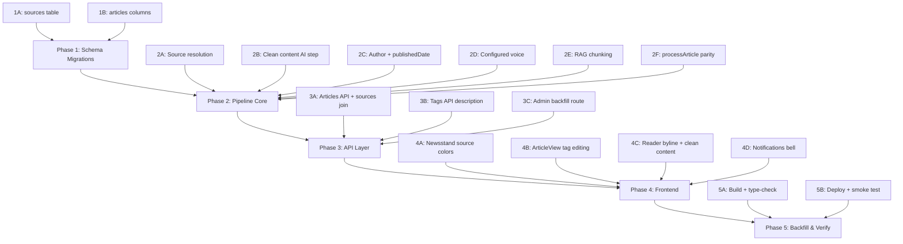

# Press — Targeted Build v3 Implementation Plan

Full-stack build across the Press ingestion pipeline, Drizzle D1 schema, Hono API, Astro+React frontend, and admin tooling. The workflow consolidates two ingestion code paths, adds source identity, cleans Reader content with AI, improves RAG with chunked embeddings, and closes frontend gaps (tag editing, notifications bell, author/date display).

---

## Execution Order & Dependencies



---

## Phase 1: Schema Migrations (Drizzle D1)

> [!IMPORTANT]  
> All schema changes use Drizzle ORM — no hand-written SQL. Run `pnpm run db:generate` after all schema edits.

### 1A. New `sources` table

#### [NEW] [sources.ts](file:///Volumes/Projects/workers/press/src/backend/db/schemas/articles/sources.ts)

```ts
// src/backend/db/schemas/articles/sources.ts
import { integer, sqliteTable, text } from "drizzle-orm/sqlite-core";

export const sources = sqliteTable("sources", {
  id: integer("id").primaryKey({ autoIncrement: true }),
  /** Hostname slug (e.g. "theverge.com"). Unique per publication. */
  key: text("key").notNull().unique(),
  /** Display name (e.g. "The Verge"). */
  name: text("name").notNull(),
  /** Brand accent color (hex or oklch). */
  accent: text("accent"),
  /** Background color for card rendering. */
  bg: text("bg"),
  /** Short badge text (e.g. "VRG"). */
  short: text("short"),
  createdAt: integer("created_at", { mode: "timestamp" }).$defaultFn(() => new Date()),
});
```

- Re-export from [articles/index.ts](file:///Volumes/Projects/workers/press/src/backend/db/schemas/articles/index.ts).

### 1B. New columns on `articles`

#### [MODIFY] [articles.ts](file:///Volumes/Projects/workers/press/src/backend/db/schemas/articles/articles.ts)

Add three columns:
- `cleanContent TEXT` — AI-trimmed article markdown (Reader prefers this; `rawContent` stays as full text)
- `ragUuid TEXT` — UUID for chunk-level vector grouping
- `sourceId INTEGER REFERENCES sources(id)` — FK to resolved source

---

## Phase 2: Pipeline Core

### 2A. Source resolution during ingestion

#### [NEW] [resolveSource.ts](file:///Volumes/Projects/workers/press/src/backend/ai/ingest/resolveSource.ts)

Logic:
1. Extract hostname from article URL → `key`.
2. Query `sources` table by `key`. If found, return it.
3. If not found, during Browser Rendering step (page is already open):
   - Read `<meta name="theme-color">` content.
   - Read computed `background-color` and `color` of `header`, `nav`, or first element matching common masthead selectors.
   - Derive `accent` (foreground/link color), `bg` (background), `name` (from `<title>` or OG:site_name), `short` (first 3 chars of hostname).
4. Insert new `sources` row and return it.

**Seed well-known sources** in the same module (static map):
```
theverge.com → { name: "The Verge", accent: "#5200ff", bg: "#000", short: "VRG" }
wired.com → { name: "Wired", accent: "#000", bg: "#fff", short: "WRD" }
arstechnica.com → { name: "Ars Technica", accent: "#ff4e00", bg: "#1a1a1a", short: "ARS" }
techcrunch.com → { name: "TechCrunch", accent: "#0a9a00", bg: "#000", short: "TC" }
```

### 2B. Clean content AI step

#### [NEW] [cleanContent.ts](file:///Volumes/Projects/workers/press/src/backend/ai/ingest/cleanContent.ts)

- Takes raw `textContent` string from Browser Rendering.
- Calls Workers AI (Llama 3.1 8B) with a prompt: _"Strip navigation menus, cookie banners, share buttons, comment sections, and site chrome from the top and bottom. Return only the article body as clean markdown, preserving headings and paragraphs."_
- Returns the cleaned markdown string.
- Workflow Step 3 (extract) will call this after metadata extraction and store result in `articles.cleanContent`.

### 2C. Author + publishedDate extraction

#### [MODIFY] [ArticleIngestionWorkflow.ts](file:///Volumes/Projects/workers/press/src/backend/workflows/ArticleIngestionWorkflow.ts)

Update `EXTRACTION_SCHEMA` to add `publishedDate`:
```ts
publishedDate: { type: "string", description: "Article publication date in ISO 8601 format, empty if unknown" },
```

Update the extract step to also persist `publishedDate` as a property alongside `author`.

#### [MODIFY] [processArticle.ts](file:///Volumes/Projects/workers/press/src/backend/ai/ingest/processArticle.ts)

Same `EXTRACTION_SCHEMA` update.

### 2D. Configured voice for audio

#### [MODIFY] [ArticleIngestionWorkflow.ts](file:///Volumes/Projects/workers/press/src/backend/workflows/ArticleIngestionWorkflow.ts) — Step 8

- Before TTS call, read `narration_voice` from preferences:
  ```ts
  const db = getDb(this.env);
  const voicePref = await db.select().from(preferences).where(eq(preferences.key, "narration_voice")).get();
  const voice = voicePref?.value ? JSON.parse(voicePref.value) : "asteria";
  ```
- Use `voice` variable instead of hardcoded `"asteria"`.

#### [MODIFY] [narration.ts](file:///Volumes/Projects/workers/press/src/backend/api/routes/narration.ts) — `POST /:id/narrate`

- When `body.voice` is not provided, read `narration_voice` from preferences (fallback `"asteria"`).

### 2E. RAG embeddings — chunked, with `rag_uuid`

#### [NEW] [chunkText.ts](file:///Volumes/Projects/workers/press/src/backend/ai/rag/chunkText.ts)

- Split text into ~800-token chunks with ~100-token overlap.
- Simple sentence-boundary-aware splitter (split on `\n\n` then `. `, accumulate until threshold).

#### [MODIFY] [ArticleIngestionWorkflow.ts](file:///Volumes/Projects/workers/press/src/backend/workflows/ArticleIngestionWorkflow.ts) — Step 4 (embed)

- Generate `rag_uuid = crypto.randomUUID()`.
- Use `cleanContent` (from step 3) if available, else `rawContent`.
- Chunk the text, embed each chunk with BGE.
- Upsert vectors: ID = `{articleId}-chunk-{chunkIndex}`, metadata = `{ rag_uuid, articleId, chunkIndex, url }`.
- Delete the temporary `pending-${jobId}` vector after the real upsert in step 5.

#### [MODIFY] [articleRag.ts](file:///Volumes/Projects/workers/press/src/backend/ai/rag/articleRag.ts)

- Update `retrieveArticleDigests`: match vector IDs now include chunk index (`{articleId}-chunk-{N}`), so extract `articleId` from metadata instead of using `m.id` directly.
- When scoped to article IDs, filter by metadata `articleId` field.
- Deduplicate by articleId before fetching digests (multiple chunks from same article).

### 2F. Bring `processArticle.ts` to parity

#### [MODIFY] [processArticle.ts](file:///Volumes/Projects/workers/press/src/backend/ai/ingest/processArticle.ts)

Add the missing steps that the Workflow already has:
1. **PDF generation** — render with `page.pdf()`, store to R2 as `pdf/{articleId}.pdf`, set `articles.pdfKey`.
2. **Mind map generation** — call `generateMindMapData()`, store to R2 + D1.
3. **Audio generation** — read configured voice from preferences, call Aura-2, store to R2, set `articles.audioKey`.
4. **Tag assignment** — call `assignArticleTags()`.
5. **Clean content** — call `cleanContent()`, store in `articles.cleanContent`.
6. **Source resolution** — call `resolveSource()`, set `articles.sourceId`.
7. **RAG chunking** — chunk + embed with `rag_uuid`.
8. **publishedDate** in extraction schema.

This closes the parity gap between the two ingestion paths.

---

## Phase 3: API Layer

### 3A. Articles API — sources join + cleanContent

#### [MODIFY] [articles.ts](file:///Volumes/Projects/workers/press/src/backend/api/routes/articles.ts)

**`GET /api/articles`**:
- Join `sources` table on `articles.sourceId`.
- Add `source: { name, accent, bg, short }` to each `ArticleListItem`.
- Include `author` and `publishedDate` from properties in the shaped response.

**`GET /api/articles/:id`**:
- Return `cleanContent` alongside `rawContent`.
- Return `source: { name, accent, bg, short }` from the joined sources row.
- Return `author` and `publishedDate` from properties.

### 3B. Tags API — `description` in CreateTagBody

#### [MODIFY] [tags.ts](file:///Volumes/Projects/workers/press/src/backend/api/routes/tags.ts)

Add `description` to `CreateTagBody`:
```ts
const CreateTagBody = z.object({
  name: z.string().trim().min(1).max(64),
  description: z.string().optional(),  // NEW
  color: z.string().optional(),
  hue: z.number().int().min(0).max(360).optional(),
});
```

Pass `body.data.description` through to the insert.

### 3C. Admin backfill route

#### [NEW] [backfill.ts](file:///Volumes/Projects/workers/press/src/backend/api/routes/backfill.ts)

**`POST /api/admin/backfill/:id`** — API-key authenticated.

For a single article by ID:
1. Check what's missing (null `cleanContent`, no `sourceId`, no `screenshotKey`, no `pdfKey`, no `mindmapKey`, no `audioKey`, no `ragUuid`, no `publishedDate` property, no `author` property).
2. For binding-dependent work (screenshot, PDF, mind map, audio, embeddings), perform the generation using Browser Rendering / Workers AI / Vectorize.
3. For DB-only work (source resolution, clean content, properties), do those inline.
4. Return a status report: `{ articleId, filled: [...], skipped: [...], errors: [...] }`.
5. Guard with `apiKeyMiddleware`.

**`GET /api/admin/backfill/status`** — returns summary of how many articles are incomplete.

Mount in [api/index.ts](file:///Volumes/Projects/workers/press/src/backend/api/index.ts).

---

## Phase 4: Frontend

### 4A. Newsstand — source accent colors

#### [MODIFY] [Newsstand.tsx](file:///Volumes/Projects/workers/press/src/frontend/components/press/pages/Newsstand.tsx)

- `ArticleCard`: replace `oklch(0.5 0.12 ${(article.id * 47) % 360})` random hue with `article.source?.accent ?? oklch(...)` for the synthetic render fallback `--src-accent`.
- `.src-tab` badge: tint with `article.source?.accent`.
- Update `Article` interface to include `source?: { name: string; accent: string | null; bg: string | null; short: string | null }`.

#### [MODIFY] [PressApp.tsx](file:///Volumes/Projects/workers/press/src/frontend/components/press/PressApp.tsx)

- Update `Article` interface to include the source object shape from the API.

### 4B. ArticleView — tag editing

#### [MODIFY] [ArticleView.tsx](file:///Volumes/Projects/workers/press/src/frontend/components/press/pages/ArticleView.tsx)

Replace the read-only tags section with editable tags:
- Each tag chip gets an `×` remove button.
- "Add tag" button opens a dropdown/combobox of all existing tags (minus already-applied ones), fetched from `GET /api/tags`.
- "Create tag" button opens a small modal with name, description, color fields → `POST /api/tags`.
- On add/remove, call `PUT /api/tags/article/:id` with the updated tag set.

### 4C. Reader byline — author + published date + clean content

#### [MODIFY] [ArticleView.tsx](file:///Volumes/Projects/workers/press/src/frontend/components/press/pages/ArticleView.tsx)

- **Byline**: show `author` (from detail.properties) and `publishedDate` (formatted). Fall back to `createdAt` only when `publishedDate` is absent.
- **Reader tab**: prefer `detail.cleanContent` over `detail.rawContent`. Fall back to `rawContent` if `cleanContent` is null.
- **Markdown tab**: same preference.
- **Source card** in side panel: use `detail.source?.accent` for the icon background instead of the random hue.

### 4D. Notifications bell

#### [MODIFY] [PressApp.tsx](file:///Volumes/Projects/workers/press/src/frontend/components/press/PressApp.tsx)

- Wire `unreadCount`: fetch from `/api/notifications?unreadOnly=true` on mount, extract `unreadCount`.
- Pass an `onBell` handler to `TopBar` that opens a notifications popover/panel.

#### [NEW] [NotificationsPanel.tsx](file:///Volumes/Projects/workers/press/src/frontend/components/press/NotificationsPanel.tsx)

- Floating popover anchored to the bell button.
- Lists notifications (title, message, type icon, time ago).
- "Mark all read" button → `PUT /api/notifications/read-all`.
- Click individual → `PUT /api/notifications/:id/read`.
- Deep link: if notification has `articleId`, clicking navigates to that article.

> [!NOTE]
> The notifications API requires auth middleware (`authMiddleware`). For the single-user setup, notifications will be sourced from ingestion events (errors, completions). If the auth middleware blocks in the single-user scenario, we'll add an unauthed variant or bypass for the notification count endpoint.

---

## Phase 5: Build, Deploy & Verify

### 5A. Build validation

1. `pnpm run db:generate` — generate migration for new `sources` table + articles column additions.
2. `pnpm tsc --noEmit` — full type-check.
3. `pnpm run build` — Astro + Worker build.

### 5B. Deploy + smoke test

1. `pnpm run deploy` (which runs `build → migrate:remote → wrangler deploy`).
2. Manual verification:
   - Submit a new article → confirm all 8 workflow steps complete (source resolved, clean content, audio with configured voice, PDF, mind map, chunked vectors).
   - Open Newsstand → cards show source accent colors.
   - Open ArticleView → Reader shows clean content, byline has author + published date, tags are editable.
   - Click bell → notifications popover works.
3. Run backfill for existing articles:
   - `GET /api/admin/backfill/status` — shows how many are incomplete.
   - Script (or manual calls) to `POST /api/admin/backfill/{id}` for each incomplete article.

---

## Files Changed Summary

| Component | File | Action |
|---|---|---|
| **Schema** | `schemas/articles/sources.ts` | NEW |
| **Schema** | `schemas/articles/articles.ts` | MODIFY (+3 columns) |
| **Schema** | `schemas/articles/index.ts` | MODIFY (add export) |
| **Pipeline** | `ai/ingest/resolveSource.ts` | NEW |
| **Pipeline** | `ai/ingest/cleanContent.ts` | NEW |
| **Pipeline** | `ai/rag/chunkText.ts` | NEW |
| **Pipeline** | `workflows/ArticleIngestionWorkflow.ts` | MODIFY (6 changes) |
| **Pipeline** | `ai/ingest/processArticle.ts` | MODIFY (parity) |
| **Pipeline** | `ai/rag/articleRag.ts` | MODIFY (chunk-aware) |
| **API** | `api/routes/articles.ts` | MODIFY (sources join) |
| **API** | `api/routes/tags.ts` | MODIFY (description) |
| **API** | `api/routes/narration.ts` | MODIFY (voice pref) |
| **API** | `api/routes/backfill.ts` | NEW |
| **API** | `api/index.ts` | MODIFY (mount backfill) |
| **Frontend** | `press/pages/Newsstand.tsx` | MODIFY (source colors) |
| **Frontend** | `press/pages/ArticleView.tsx` | MODIFY (tags, byline, clean content, source accent) |
| **Frontend** | `press/PressApp.tsx` | MODIFY (notifications, source type) |
| **Frontend** | `press/NotificationsPanel.tsx` | NEW |

---

## Open Questions

> [!IMPORTANT]
> **Notifications auth**: The current `/api/notifications` route uses `authMiddleware` which requires a `userId`. In a single-user setup, should I:
> - (a) Create a parallel unauthed notification count endpoint (`GET /api/notifications/count`), or
> - (b) Bypass auth for notification routes, or
> - (c) Use a hardcoded user ID (1) for the single-user scenario?

> [!IMPORTANT]
> **Newsstand rails grouping**: The handoff mentions "fixed category desks vs top-tags-by-frequency." Current impl groups by tags sorted by frequency. Should I keep this behavior, or switch to a fixed set of source-based desks (one rail per publication)?
